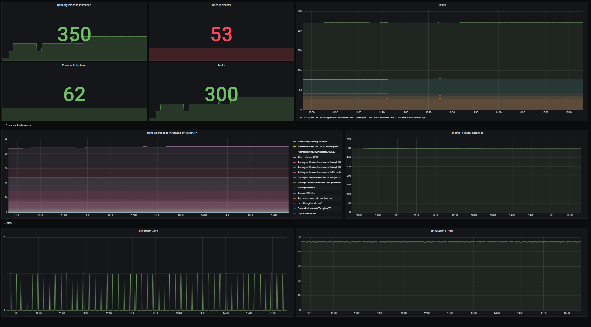

[![Contributors][contributors-shield]][contributors-url]
[![Forks][forks-shield]][forks-url]
[![Stargazers][stars-shield]][stars-url]
[![Issues][issues-shield]][issues-url]
[![MIT License][license-shield]][license-url]

# DigiWF Camunda Prometheus Exporter

The DigiWF Camunda Prometheus Exporter library exports Camunda Metrics for prometheus and allows to register own metric providers for [digiwf](https://digiwf.oss.muenchen.de).




<!-- TABLE OF CONTENTS -->
<details>
  <summary>Table of Contents</summary>
  <ol>
    <li>
      <a href="#about-the-project">About The Project</a>
      <ul>
        <li><a href="#built-with">Built With</a></li>
      </ul>
    </li>
    <li>
      <a href="#getting-started">Getting Started</a>
    </li>
    <li><a href="#usage">Usage</a></li>
    <li><a href="#contributing">Contributing</a></li>
    <li><a href="#license">License</a></li>
    <li><a href="#contact">Contact</a></li>
  </ol>
</details>


## Features

* **Task Metrics:** Metrics for assigned and unanssigned tasks
* **Incident Metrics:** Open Incidents
* **Process Metrics:** Deployed Definitions and Open Process Instances
* **Job Metrics:** Executable, suspended and future job metrics


## Built With

This project is built with:

* [Spring Boot](https://spring.io/projects/spring-boot)
* [Micrometer](https://micrometer.io/)
* Inspired by [Camunda Prometheus Exporter](https://github.com/camunda-consulting/prometheus-camunda-exporter)


## Getting Started

_Below is an example of how you can installing and setup up your service_

1. Use the camunda initalizer and create a Spring Boot application with `Web`
   dependencies [https://start.camunda.com/](https://start.camunda.com/)
2. Add the spring-boot-actuator and digiwf-camunda-prometheus dependency

With Maven:

```
  <dependency>
      <groupId>org.springframework.boot</groupId>
      <artifactId>spring-boot-starter-actuator</artifactId>
      <version>2.6.4</version>
  </dependency>

   <dependency>
        <groupId>io.muenchendigital.digiwf</groupId>
        <artifactId>digiwf-camunda-prometheus-starter</artifactId>
        <version>${digiwf.version}</version>
   </dependency>
```

With Gradle:

```
implementation group: 'io.muenchendigital.digiwf', name: 'digiwf-camunda-prometheus-starter', version: '${digiwf.version}'
implementation group: 'org.springframework.boot', name: 'spring-boot-starter-actuator', version: '2.6.4'
```

3. Add your own Metrics by implementing the ``MetricsProvider`` Interface


## Contributing

Contributions are what make the open source community such an amazing place to learn, inspire, and create. Any
contributions you make are **greatly appreciated**.

If you have a suggestion that would make this better, please fork the repo and create a pull request. You can also
simply open an issue with the tag "enhancement". Don't forget to give the project a star! Thanks again!

1. Fork the Project
2. Create your Feature Branch (`git checkout -b feature/AmazingFeature`)
3. Commit your Changes (`git commit -m 'Add some AmazingFeature'`)
4. Push to the Branch (`git push origin feature/AmazingFeature`)
5. Open a Pull Request


## License

Distributed under the MIT License. See [LICENSE](LICENSE) for more information.


## Contact

it@M - opensource@muenchen.de

Join our [Slack Channel](https://join.slack.com/t/digiwf/shared_invite/zt-14jxazj1j-jq0WNtXp7S7HAwJA7tKgpw) for more
information!


[contributors-shield]: https://img.shields.io/github/contributors/it-at-m/digiwf-camunda-prometheus.svg?style=for-the-badge

[contributors-url]: https://github.com/it-at-m/digiwf-camunda-prometheus/graphs/contributors

[forks-shield]: https://img.shields.io/github/forks/it-at-m/digiwf-camunda-prometheus.svg?style=for-the-badge

[forks-url]: https://github.com/it-at-m/digiwf-camunda-prometheus/network/members

[stars-shield]: https://img.shields.io/github/stars/it-at-m/digiwf-camunda-prometheus.svg?style=for-the-badge

[stars-url]: https://github.com/it-at-m/digiwf-camunda-prometheus/stargazers

[issues-shield]: https://img.shields.io/github/issues/it-at-m/digiwf-camunda-prometheus.svg?style=for-the-badge

[issues-url]: https://github.com/it-at-m/digiwf-camunda-prometheus/issues

[license-shield]: https://img.shields.io/github/license/it-at-m/digiwf-camunda-prometheus.svg?style=for-the-badge

[license-url]: https://github.com/it-at-m/digiwf-camunda-prometheus/blob/master/LICENSE

[product-screenshot]: images/screenshot.png
